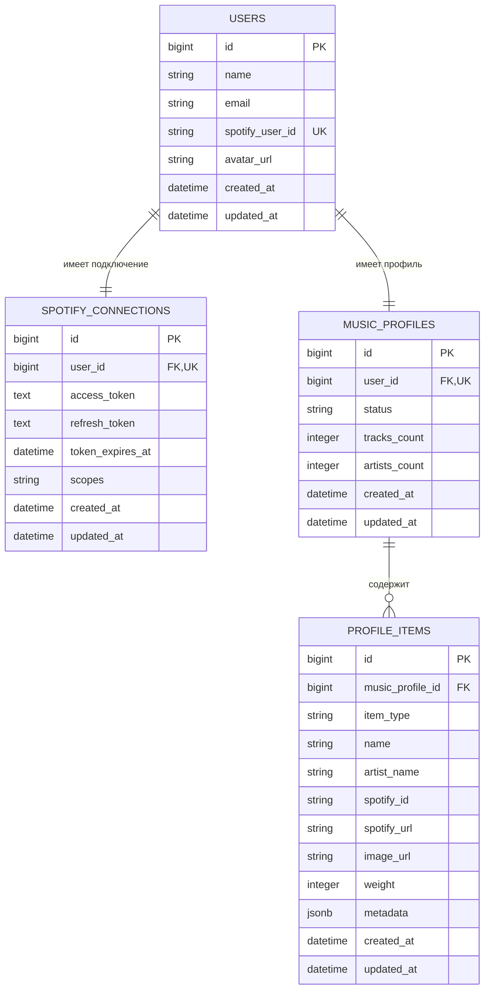

# Схема базы данных MusicMate

В проекте используется PostgreSQL. База данных содержит четыре основные таблицы:

- `users` — пользователи приложения;
- `spotify_connections` — данные подключения пользователей к Spotify;
- `music_profiles` — музыкальные профили пользователей;
- `profile_items` — любимые исполнители и треки.

## ER-диаграмма



Обозначения:

- `PK` — первичный ключ;
- `FK` — внешний ключ;
- `UK` — уникальное поле или уникальный индекс;
- `||--||` — связь «один к одному»;
- `||--o{` — связь «один ко многим».

## Таблица `users`

Хранит основную информацию о пользователе, полученную из Spotify.

| Поле | Тип | Назначение |
|---|---|---|
| `id` | bigint | Уникальный идентификатор пользователя |
| `name` | string | Имя пользователя |
| `email` | string | Email пользователя, может отсутствовать |
| `spotify_user_id` | string | Уникальный ID пользователя в Spotify |
| `avatar_url` | string | Ссылка на аватар пользователя |
| `created_at` | datetime | Дата создания записи |
| `updated_at` | datetime | Дата последнего обновления |

Поле `spotify_user_id` имеет уникальный индекс. Благодаря этому один аккаунт Spotify не может создать несколько пользователей MusicMate.

## Таблица `spotify_connections`

Хранит данные, необходимые backend для обращения к Spotify API.

| Поле | Тип | Назначение |
|---|---|---|
| `id` | bigint | Уникальный идентификатор подключения |
| `user_id` | bigint | Ссылка на пользователя |
| `access_token` | text | Токен для запросов к Spotify API |
| `refresh_token` | text | Токен для получения нового access token |
| `token_expires_at` | datetime | Время окончания действия access token |
| `scopes` | string | Разрешения, предоставленные пользователем |
| `created_at` | datetime | Дата создания записи |
| `updated_at` | datetime | Дата последнего обновления |

`user_id` является внешним ключом и имеет уникальный индекс. Поэтому у одного пользователя может быть только одно подключение Spotify.

## Таблица `music_profiles`

Хранит состояние музыкального профиля пользователя.

| Поле | Тип | Назначение |
|---|---|---|
| `id` | bigint | Уникальный идентификатор профиля |
| `user_id` | bigint | Ссылка на пользователя |
| `status` | string | Состояние профиля: `empty`, `ready` или `failed` |
| `tracks_count` | integer | Количество полученных треков |
| `artists_count` | integer | Количество полученных исполнителей |
| `created_at` | datetime | Дата создания записи |
| `updated_at` | datetime | Дата последнего обновления |

`user_id` имеет уникальный индекс, поэтому у пользователя может быть только один музыкальный профиль.

## Таблица `profile_items`

Хранит элементы музыкального профиля. В одной таблице находятся и исполнители, и треки.

| Поле | Тип | Назначение |
|---|---|---|
| `id` | bigint | Уникальный идентификатор элемента |
| `music_profile_id` | bigint | Ссылка на музыкальный профиль |
| `item_type` | string | Тип элемента: `artist` или `track` |
| `name` | string | Название трека или имя исполнителя |
| `artist_name` | string | Исполнитель трека; для записи исполнителя не используется |
| `spotify_id` | string | Идентификатор элемента в Spotify |
| `spotify_url` | string | Ссылка на элемент в Spotify |
| `image_url` | string | Ссылка на изображение |
| `weight` | integer | Позиция элемента в рейтинге пользователя |
| `metadata` | jsonb | Дополнительные данные, например жанры исполнителя |
| `created_at` | datetime | Дата создания записи |
| `updated_at` | datetime | Дата последнего обновления |

Составной индекс по `music_profile_id` и `item_type` ускоряет получение всех исполнителей или всех треков конкретного профиля.

## Связи между таблицами

### Пользователь и подключение Spotify

```text
users.id = spotify_connections.user_id
```

Связь «один к одному». Подключение не может существовать без пользователя.

### Пользователь и музыкальный профиль

```text
users.id = music_profiles.user_id
```

Связь «один к одному». У каждого пользователя может быть один музыкальный профиль.

### Музыкальный профиль и его элементы

```text
music_profiles.id = profile_items.music_profile_id
```

Связь «один ко многим». Один профиль может содержать много исполнителей и треков.

При удалении пользователя Rails также удаляет его подключение Spotify и музыкальный профиль. При удалении музыкального профиля удаляются связанные с ним элементы.

